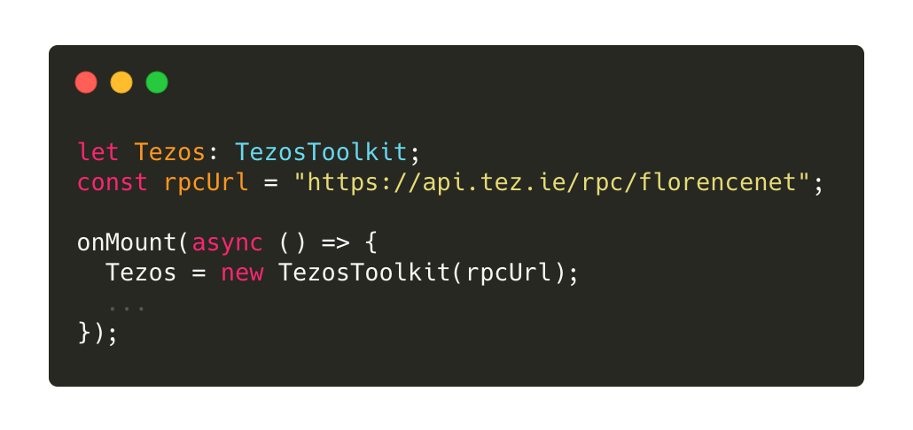
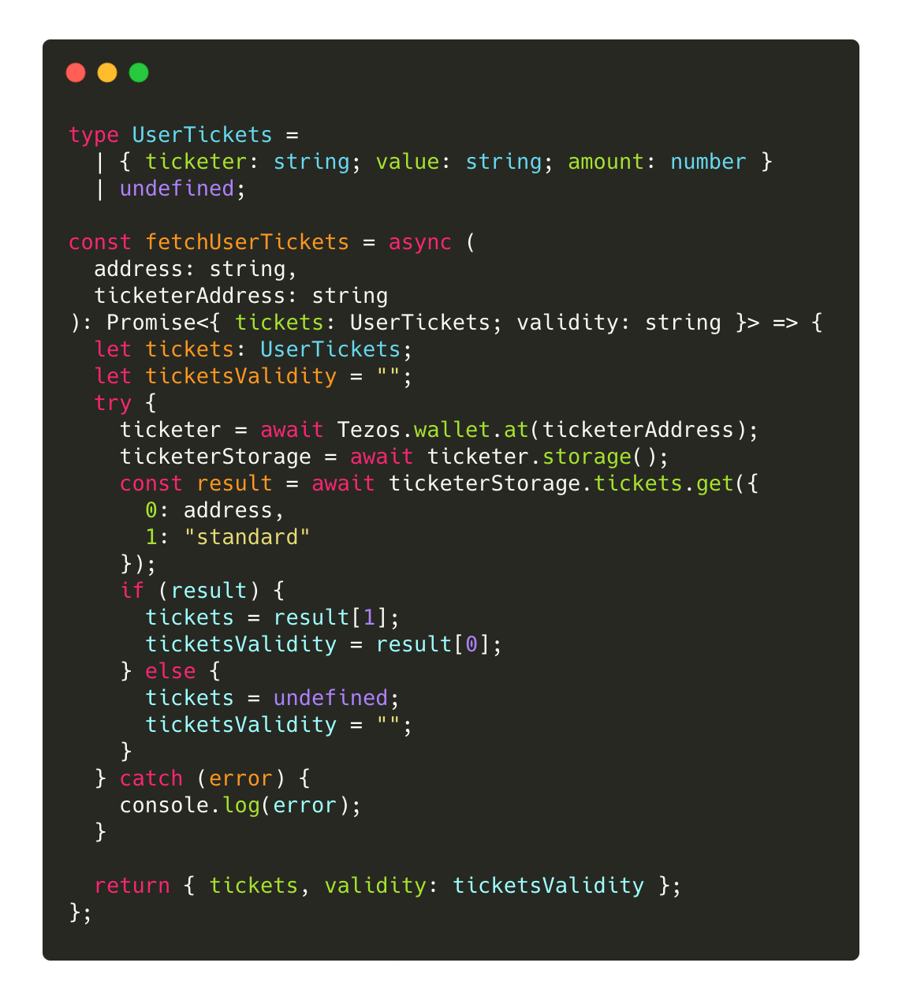
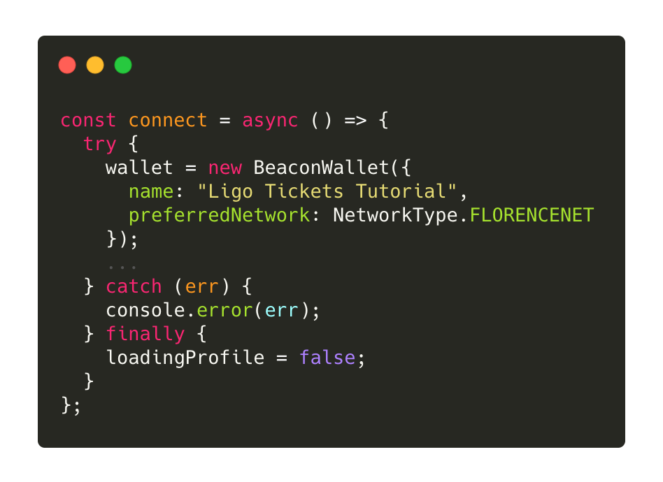
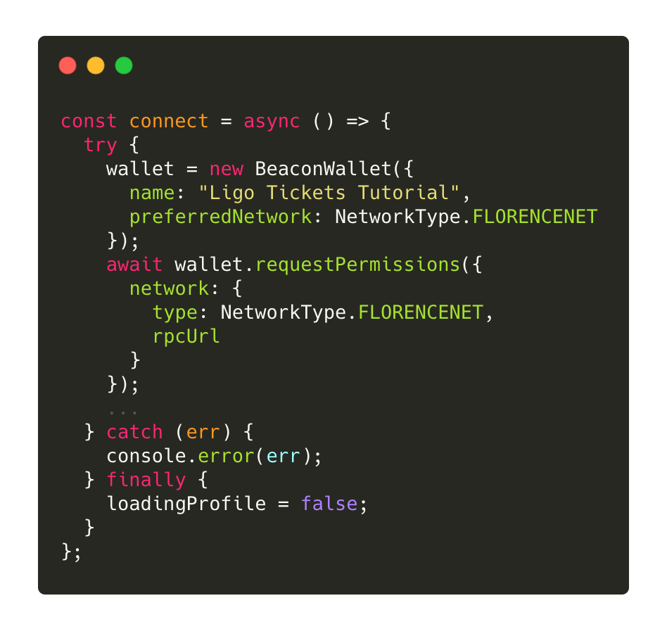
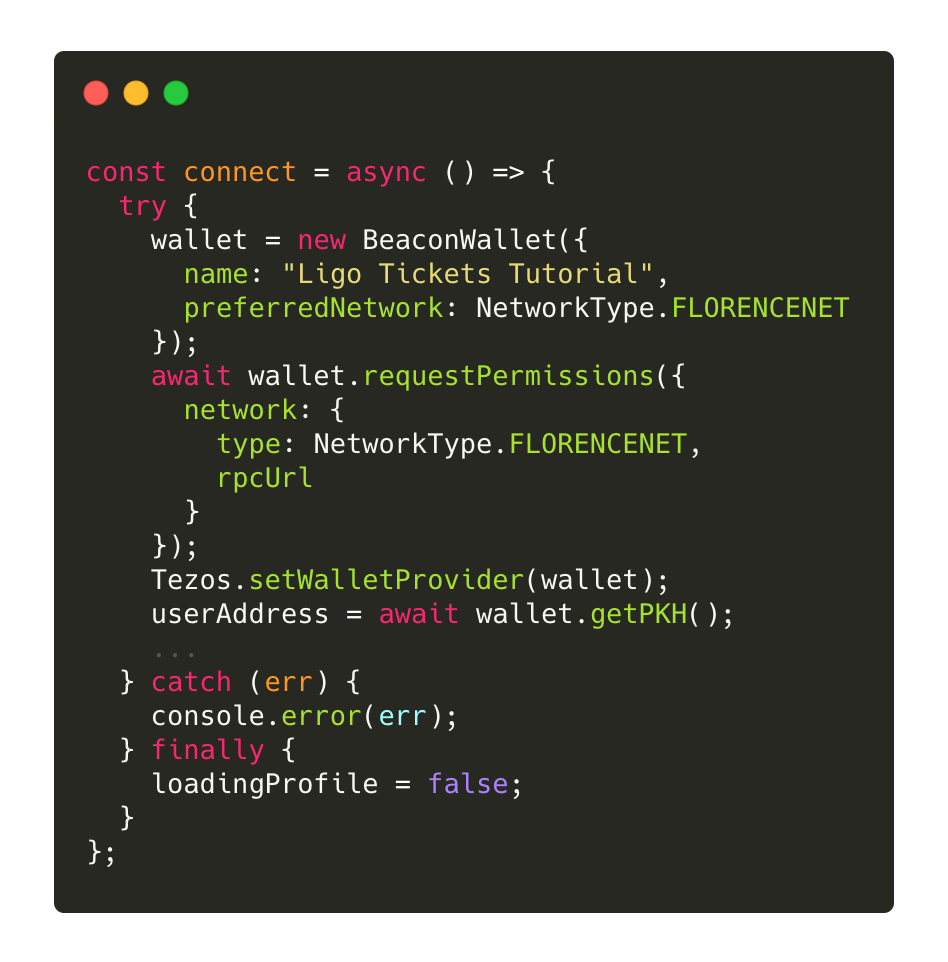
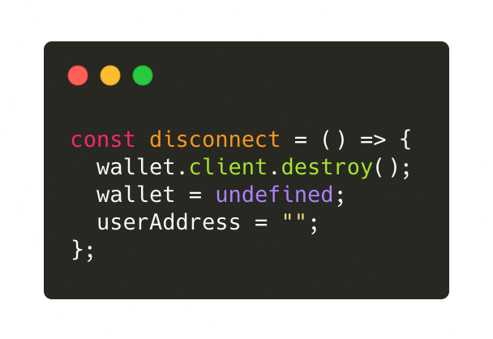
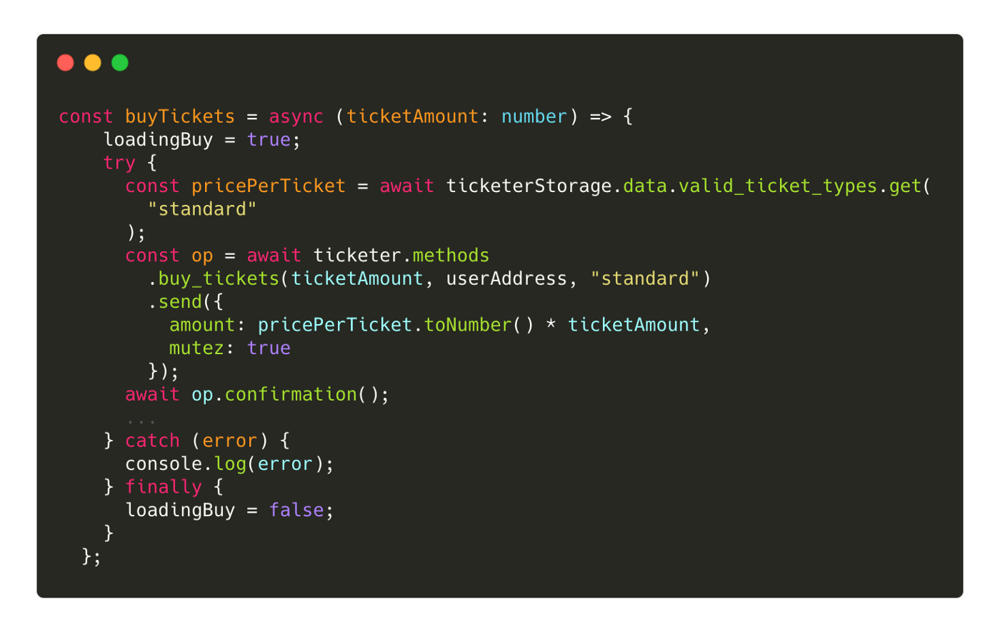

## Build your first Tezos dApp

### How to build your first Tezos dapp \(2021 edition\) <a id="1ce3"></a>


It’s been more than a year since I wrote [How to build your first dapp on Tezos](https://betterprogramming.pub/build-your-first-dapp-on-tezos-270c568d4fe9). At that time, creating dapps that work with the Tezos blockchain was still in its infancy, it was difficult, the tooling was nonexistent or undocumented and the features limited. There was only a handful of developers who had experience with building apps on Tezos. I started my journey on Tezos at this point when building dapps was hard and I decided to document it in order to help other developers who would come after me.

A year later, the Tezos ecosystem has bloomed even more than we imagined, there are many complex and beautiful dapps out there, over a million contract calls per month, and new developers joining every day. The recent success of Tezos dapps doesn’t mean that onboarding new developers is over. On the contrary, it becomes even more important and my tutorial from last year needed an update.

This article follows my last article about [tickets in Ligo](https://medium.com/ecad-labs-inc/how-to-use-tickets-with-ligo-e773422644b7). In this previous article, we learned about one of the new features of the Tezos blockchain, [tickets](https://tezos.gitlab.io/009/michelson.html#operations-on-tickets). We created a smart contract that issues and redeems tickets. Now the time has come to build a dapp upon this contract and create an interface that people around the world can use to buy or redeem tickets. The dapp itself will be pretty simple. It will demonstrate some important features such as how to login to a wallet, how to autologin the returning users, how to send a transaction to a contract, and how to get the contract storage.

The dapp uses two main packages: the [Taquito package](https://github.com/ecadlabs/taquito/tree/master/packages/taquito) and the [BeaconWallet package](https://github.com/ecadlabs/taquito/tree/master/packages/taquito-beacon-wallet) \(a wrapper for [Airgap’s Beacon SDK](https://github.com/airgap-it/beacon-sdk) offered by Taquito\). The dapp itself is written using the [Svelte](https://svelte.dev/) framework but the principles you will learn here can be applied to any other frameworks. I also decided to use [TypeScript](https://www.typescriptlang.org/) for the dapp as it prevents a large number of bugs and both Taquito and the Beacon SDK offer various types out of the box.  
If you want to check the whole code of the dapp, it is available in [this Github repository](https://github.com/claudebarde/ligo-tickets-tutorial).

Without further ado, let’s learn how to build a Tezos dapp 👷👷‍♂️

### Installing and importing the required packages <a id="9096"></a>

As mentioned above, the dapp is using two main packages: the `Taquito` package \(to interact with the blockchain\) and the `BeaconWallet` package \(to interact with the user’s wallet\). These packages are available from `NPM` and you can easily install them with `npm i @taquito/taquito @taquito/beacon-wallet`. At the top of the main component of the dapp, we can now import two classes we need for our dapp, the `TezosToolkit` from the `Taquito` package and the `BeaconWallet` from the `BeaconWallet` package:


From the `Taquito` package, we need the `TezosToolkit` to communicate with the Tezos blockchain. From the `BeaconWallet` package, we need the `BeaconWallet` class to interact with the users’ wallets. In addition to that, we are also going to import different things we will need to set up the dapp:

* `onMount` from the `svelte` package allows us to prepare the dapp environment when the users load the dapp, we will set up their wallet and their connection to the blockchain
* the `Taquito` package exposes different types and interfaces that we can use with TypeScript to make our code more robust, in this case, `ContractAbstraction` \(that represents the instance of a contract on the dapp level\) and `Wallet` \(that represents an instance of a wallet\)
* `NetworkType` is a useful [enum](https://www.typescriptlang.org/docs/handbook/enums.html) exposed by the `@airgap/beacon-wallet` that we will use to connect the wallet.

> Note: you don’t need to install the `Beacon SDK` package yourself, it is part of the `BeaconWallet` package and will already be present in your `node_modules` folder.

### Setting up the environment on mount <a id="c311"></a>

When the users will first visit the dapp, we have to set up the dapp environment to make sure it connects to the Tezos blockchain and the user’s wallet properly. Svelte has a built-in function called `onMount` that is triggered once when the app is mounted. We will set up the dapp within this function:



First, we set up the `TezosToolkit`. Because it is a class, we can create an instance of it with the `new` keyword and we will save it in the Tezos variable \(but you can use whatever variable name you like\). The `TezosToolkit` expects as a parameter the URL of the RPC node you want to connect to. You can use the one in the example or any other one of your choice. Be careful that the node you choose will decide the network you connect to \(here the Florencenet testnet\).

After taking care of the Tezos toolkit, let’s take care of the wallet!


We create a new instance of the wallet by calling `BeaconWallet` and passing it an object. This object must have at least 1 property called `name` with the name of your dapp \(that’s the name that will be displayed in the wallet when you will ask users to sign transactions\). You should also use the `preferredNetwork` property that allows you to use the Kukai wallet during development. This property takes the name of the network you want to connect to as a value and this is when we can use the `NetworkType` enum.

After the wallet has been instantiated, we are checking if there is already an active wallet, which would mean the users are returning users and we can connect them automatically. The instance of the BeaconWallet has a property `client` with a method called `getActiveAccount` that checks if the users had connected their wallets before. If it is the case, this is what we can do:


* `Tezos.setWalletProvider(wallet)`: this step is necessary to register the newly created wallet and to use it to sign transactions. The argument is an instance of the `BeaconWallet`
* `userAddress = activeAccount.address`: we get the user’s address which can be useful as much as in the interface \(so the users can know with which address they are connected\) as in the code \(for example, in the following line to fetch the existing tickets\)

After setting up the gears of the dapp, we also want to take care of its main purpose: buying and redeeming tickets. We are going to write a custom function that fetches the users’ tickets, either when they connect their wallet or when they return to the dapp:



The fetchUserTickets is a good example of how to fetch data in a contract `bigmap` using `Taquito`:

1. You create the instance of the contract using the `at` method of the `wallet` property on the TezosToolkit instance \(here, we store this instance in the `ticketer` variable\) =&gt; `await Tezos.wallet.at(contractAddress)`
2. You fetch the storage of the contract using the `storage` method present on the contract instance =&gt; `await ticketer.storage()`
3. Knowing the name of the `bigmap`, you can use it as a property on the storage instance and call the `get` method on it with the key you are looking for to get its value=&gt; `await ticketerStorage.tickets.get(keyToFind)`
4. The `get` method returns the value associated with the key or `undefined` if the key was not found.

> Note: if the key is `undefined`, the node will return a 404 error message. This can be confusing if you keep an eye on your console logs as it looks like an error, but it isn’t.

The tickets are stored as values of the `bigmap` and are associated with a key represented as a `pair` with the address of the owner on the left and the ticket type on the right. In order to fetch it with Taquito, you can pass an object to the `get` function with 2 properties: `“0”` for the left side of the pair and `“1”` for the right side of the pair. The call will return an `object` because the values in the `bigmap` are pairs. On the left side, you have the timestamp of the last time the user bought tickets, on the right side, the actual ticket. These are the 2 values the function returns.

After getting the timestamp and the ticket from the `bigmap`, we can save them in variables to use them in the interface.

### Connecting and disconnecting the wallet <a id="3710"></a>

The first time the users will visit your dapp, they will need to connect their wallet. The above example of the code connecting the wallet on mount only applies to returning users, so we have to offer a solution for our first-time users to connect their wallet.

After the users connect their wallet, we are going to save their address in a variable called `userAddress`, so this is the value we can use to show a Connect/Disconnect button:

```text
{#if userAddress}
   
{:else}
   
{/if}
```

Now let’s have a look at the different steps to connect a user with the `BeaconWallet`:



The first step is the same as when we instantiated the wallet on mount. However, after creating the instance of the wallet, we have to request permission from the users to connect to their wallets, which will also allow them to choose the wallet they want to use. The `requestPermissions` method on the wallet instance will open the Beacon popup and request the users to choose a wallet and connect to it:



This method takes a JavaScript object as a parameter with one mandatory property: `network`. The property itself takes another object with a `type` property \(accepting a value of type `NetworkType`, the enum we imported earlier from `@airgap/beacon-sdk`\) and a `rpcUrl` property \(with the address of the node you want to connect to\). After the user accepts the connection, we can move on and fetch the different information we need.

> Note: it is a good idea to put the code to connect to a wallet into a `try…catch…` statement. This is prone to bugs and unexpected behaviours \(like users not giving their permissions or failing connections\) and you should handle them.

Once we have the permission, we have to tell the Tezos toolkit from Taquito we created earlier to use the wallet we’ve been allowed to use and we can get the user’s address with the `getPKH` method on the wallet instance:



The `TezosToolkit` instance exposes a method called `setWalletProvider` that you just need to call and pass the newly created wallet to in order to set up the signer. Then, you can get the user’s address with `await wallet.getPKH()`.

> Note: forgetting to set the wallet provider is a common reason of the `Signer Not Configured` error, along with using the Contract API instead of the Wallet API.

After that it’s set, we can fetch the user’s tickets in the same way we did it on mount for returning users:


We should also allow our users to manually disconnect their wallet \(for example, if they want to switch to a different wallet\). The `disconnect` function is pretty simple, the `wallet` instance exposes the `client` instance of the `Beacon SDK` as a property on which you can call the `destroy` method. We will also reset `wallet` and `userAddress` to return the interface to its original state:



### Buying tickets <a id="08dc"></a>

Setting up the dapp and the wallet is actually the most complex part of the code, buying and redeeming tickets is going to be a breeze!

We can start by setting up the button the users will press to buy a ticket. The button will have 2 different states: one when it’s waiting for a press and one when it’s waiting for the confirmation of the buy:


The request to buy a ticket will switch `loadingBuy` to `true`, which will add the `loading` class to it and disable it \(in order to prevent multiple clicks\). At the same time, we only trigger `buyTickets` if the user is not already waiting for the confirmation of a previous buy.

> Note: the number of tickets to buy \(1\) is hard-coded here but you can also request it from the users.

Here is how we are going to contact the ticketer contract to get a ticket to the user:


First, we must find the price per ticket, fortunately, this information is recorded in the contract and associated with the ticket type. In order to get it, we can simply call the `get` method available on every bigmap of the storage and pass the key we are looking for, `standard`. If you remember from earlier, the call is going to fail with a `404` error code if the key doesn’t exist and it will be caught in the `try… catch…` statement before sending the transaction.

Now comes the time for the call to the smart contract:



The contract exposes an entrypoint called `buy_tickets` that takes 3 parameters: the number of tickets to create, the address to be credited with the tickets and the type of tickets. The number of tickets is passed to the function as `ticketAmount`, we will use the address that we stored in `userAddress` when the user connected their wallet and the ticket type is just going to be “standard”. Every entrypoint of the contract is available by name as a method on the `methods` property of the contract abstraction. In order to send the transaction, you call `send` on the return value of the entrypoint function.

Every call to a contract entrypoint with Taquito returns an operation object \(here, `op`\). This object exposes different properties and methods, but the ones you will use the most are the `opHash` property that holds the hash of the transaction and the `confirmation` method that waits for the transaction to be confirmed. By default, `op.confirmation()` waits for 1 confirmation, but you can wait for more by passing the number of confirmations you want as a parameter \(for example, `op.confirmation(10)` to wait for ten confirmations\).

Once the confirmation has come through, we’d like to update the interface. We could easily do it by incrementing the variable holding the user’s tickets but for the sake of demonstrating how to handle the contract storage with Taquito, let’s fetch the data from the contract and use it to update the interface:


First, let’s get a fresh instance of the storage, or we would pull the old data from before the update: `ticketerStorage = await ticketer.storage()`. This creates a representation of the whole storage in your dapp and you can now access all the information available in the storage.

> Note: at this point, the transaction has been confirmed and the updated storage is available. The storage you get after _`op.confirmation()`_ is the new storage.

The users’ tickets are stored in the `tickets` bigmap so we just need to use the right key to access the number of tickets owned by the user. In the case of a pair used as a key in a bigmap, you can simply pass an object to the `get` method with 2 properties: `“0”` for the value in the left field of the pair and `“1”` for the value in the right field of the pair. If we get a result, it means the user has tickets and we can update the number of tickets \(`userTickets`\) and their validity \(`userTicketValidity`\). Otherwise, we reset everything to zero.

> Note: we’ve just updated the user’s tickets so we know there are tickets but it’s always better to handle unexpected cases.

Now that our users can buy tickets, let’s give them the opportunity to redeem them!

### Redeeming tickets <a id="2f0a"></a>

Redeeming tickets is going to be a pretty straightforward operation: you provide the type of tickets you want to redeem and the contract uses the sender’s address to decrement their balance. A limit of one ticket is hardcoded in the contract so we won’t handle the number of tickets to redeem from the dapp. Just like buying tickets, the entrypoint we need to call is a method available in the `methods` property of the contract abstraction:


This function should look familiar, as it is very similar to the one to buy tickets. Here is what happens:

1. We forge a new operation by calling the entrypoint method, passing it the type of ticket \(“standard”\) before calling `send` to send the transaction
2. We call `confirmation` on the operation object to wait for the transaction to be included in a block
3. Once included, we fetch the new storage by calling `storage` on the ticketer contract abstraction
4. To finish, we load the user’s new balance and save it in a variable to be displayed in the interface.

### Conclusion <a id="1b80"></a>

This was a long tutorial, but it introduced you to the basics of creating a dapp on Tezos: communicating with the blockchain using `Taquito`, connecting to the users’ wallets using `Beacon`, sending transactions and fetching a contract storage. This is all you need to create a simple dapp.

From here, you can build your knowledge and try to interact with more complex contracts, read more complex storages, interact with bigmaps and batch operations. The possibilities are limitless!

If you want to go further with Taquito, you can check the [official documentation](https://tezostaquito.io/docs/quick_start) with a ton of examples and useful tips for your dapps.

Don’t hesitate to post a link in the comment section to what you built after following this tutorial 😄

