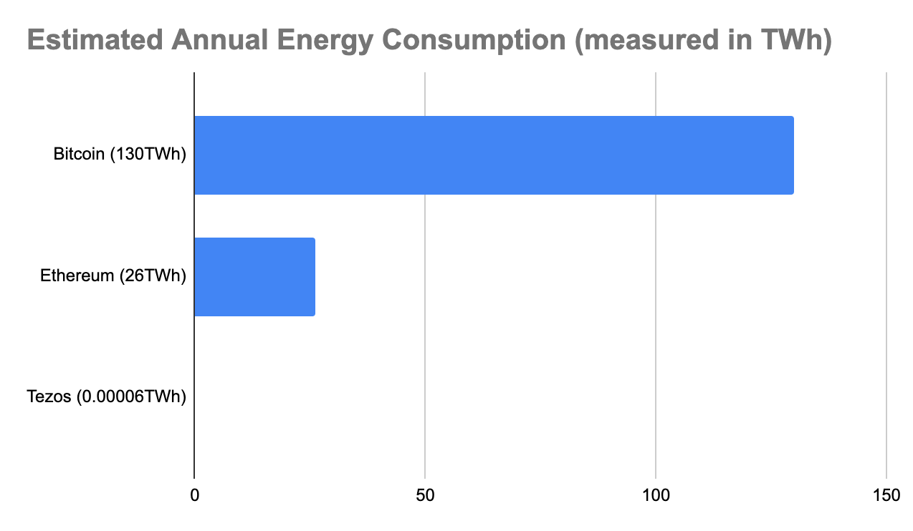

## Tezos Energy Consumption

The energy consumption of Bitcoin, Ethereum, and other Proof of Work-based blockchain networks has become a popular [topic](https://www.wired.com/story/nfts-hot-effect-earth-climate/) [of](https://mashable.com/article/nft-cryptocurrency-bad-environment-art/) [discussion](https://earther.gizmodo.com/how-to-fix-crypto-art-nfts-carbon-pollution-problem-1846440312) in recent weeks.

How much energy do Bitcoin and Ethereum consume? How do they compare to Tezos’ energy consumption, and that of newer blockchains?

We’ll give the bottom line first: [reasonable estimates](https://cbeci.org/) from the University of Cambridge place Bitcoin’s current annual energy consumption at 130TWh, a continuous draw of 15 gigawatts of electricity. If Bitcoin were a country, its annual energy consumption would place it between the mid-sized countries of Ukraine and Argentina. [Some estimates](https://digiconomist.net/ethereum-energy-consumption/#:~:text=The%20Ethereum%20Energy%20Consumption%20Index,consumption%20of%20the%20Ethereum%20network.&text=Download%20data%20%28note%3A%20index%20is%20still%20in%20beta%29.&text=Comparable%20to%20the%20power%20consumption%20of%20Ecuador.&text=Equivalent%20to%20the%20power%20consumption,U.S.%20household%20over%201.74%20days) of Ethereum’s annual energy consumption place it at around 26TWh, a draw of 3 gigawatts, comparable to Ecuador, a country of 17 million people.

By contrast, the energy used annually by validators of the Tezos network is probably in the range of 60MWh, a continuous draw of perhaps 7 kilowatts.

These numbers differ by a factor of **over two million**, between six and seven orders of magnitude.

Proof of Work networks incentivize miners to produce blocks with a block reward funded via inflation, taxing all holders of the tokens to execute transactions on the network. So long as the tokens appreciate rapidly in value, that inflation-based tax is ignored by the holders; this may no longer be true if appreciation stops.

In addition to the raw difference in the cost of running these networks, which is ultimately reflected in the transaction costs of operating the networks, the ecological distinction is astonishing. Popular usage, even just a few common transactions, on Proof of Work networks can use as much energy, and according to [some estimates](https://github.com/kylemcdonald/cryptoart-footprint) can have as much of a carbon footprint as driving a gas-powered sedan one-thousand kilometers. Indeed, the energy used in these systems has become a substantial portion of the world’s energy budget.

Furthermore, even though chips and computers have become more energy-efficient over time, this has no bearing on the energy consumption of Proof of Work networks, as it is the financial cost of the computation, and not the computation itself, that protects the safety of the network. Even if the use of renewable energy lowered the cost of electricity by half, miners would need to burn twice as much. Furthermore, the use of off-peak renewable energy by cryptocurrency mining crowds out the development of grid-scale energy storage solutions which are necessary for the world to switch to renewable energy.

Unlike a Proof of Work-based consensus system like Ethereum or Bitcoin, a Proof of Stake network like Tezos does not depend on the cost of the electricity it burns to thwart potential attackers. Instead, it depends on direct economic incentives, whether through a carrot \(block rewards\) and/or via a stick \(“slashing”, in which the stakeholders post bonds which can be seized if they misbehave\).

As such, a Proof of Stake network has no lower bound on the amount of energy it needs to expend. Indeed, as computer technology improves, we can expect the power required to drop.

Energy consumption differences are even more stark when we compare the cost of a single transaction in each network. The Bitcoin network can only conduct roughly 5 transactions per second, for an energy cost per transaction of 830kWh. Ethereum can conduct around 15 transactions per second, for an energy cost per transaction of 50kWh. Tezos can conduct about 52 transactions per second, for an energy cost per transaction of 30mWh. The difference between Bitcoin and Tezos here is a factor of 25 million, the difference between Ethereum and Tezos is a factor of 1.5 million.

For those interested in NFTs, according to [some estimates](http://cryptoart.wtf/#list=nfts), the energy cost of minting an NFT on Ethereum is 332kWh \(presuming full blocks\), and the similar cost \(presuming full blocks\) on Tezos is 200mWh, or a factor of about 1.5 million.

**Calculating Tezos’ energy consumption**

We cannot know the exact energy consumed by the bakers \(known as “validators” in other Proof of Stake systems\) in the Tezos network because, as with most blockchains, Tezos is a permissionless and decentralized network. We thus do not have the ability to measure the power used by every single computer in the network. However, we can place reasonable lower and upper bounds of the power used by machines participating in the network, and we know the current number of participants in the baking system, which is currently about 400 bakers.

A Raspberry Pi 4B or CM4 with about 8GB of RAM is a reasonable minimum for a baker; we know of a number of bakers running on such hardware. The Raspberry Pi is based on a Broadcom manufactured ARM CPU, and typically retails in such a configuration for substantially below $100. Based on measurements, it appears that the average continuous power draw for such a machine, when used as a baker, is about 3 watts. If all bakers used similar hardware, we would expect a consumption of about 1200 watts for the entire set of bakers, approximately the same as a single hairdryer or toaster oven. Multiplying by 8760 hours per year, and we reach a number of 10.5MWh/year.

Another common choice of a machine for baking is an Intel NUC. We measured the power consumption of a recent vintage four core Intel NUC device running an actual baker, and found that it had a continuous draw of about 9 watts. This is larger principally because of the lower power efficiency of Intel microprocessors compared to ARM-based processors. If all Tezos baker machines ran on such hardware, the continuous power draw would be about 3600 watts, still dramatically lower than most households, or about 31.5MWh/year.

Guessing the likely upper limit of power usage is more difficult. We presume that this would be associated with high-end servers employed as bakers. Note that dedicating such hardware to baking is completely unnecessary; typical data center class server hardware provides _vastly_ more CPU performance and i/o bandwidth than is required for a baker.

This is even harder to calculate when a baker is running on a cloud service. In typical modern cloud data centers, a baker’s virtual machine might share such a physical machine with many other simultaneous workloads, and we do not have good data available from Amazon, Google, Microsoft, and other cloud computing providers on energy usage for a typical load like that of a baker. This is further complicated by the fact that cloud providers typically have many available tiers of virtual machines, and that some \(like AWS\) allow the user to choose between Intel and ARM CPUs, with their very different power consumption characteristics.

However, we believe a conservative guess for the continuous power draw reasonably attributable to a baker running on the x86 architecture on bare metal or a VM in such an environment might be 100 watts. \(Older hardware with worse power consumption characteristics can run bakers; we presume most bakers in data centers use reasonably recent hardware.\) Given the 100 watt continuous assumption, we find a constant draw for the network of 40,000 watts, somewhat less than the maximum draw for two modern suburban homes in the United States, which are now typically built with 120VAC service at 200A. This is about 350MWh/year.

We note again that there is no particular reason that a baker _needs_ to consume so much power; the 3 watt devices described above are sufficient for the task.

This gives us an energy consumption minimum for the Tezos network of about 10.5MWh per year, and a possible \(though difficult to measure\) likely maximum in the range of 350MWh/year. We presume the real answer lies somewhere between; a geometric mean of these numbers is about 60MWh/year. However, this is so much less energy than is consumed by popular Proof of Work-based cryptocurrencies that the distinction between these numbers, though large, matters relatively little. Whichever is selected, the difference in energy used is stark. Furthermore, as we note elsewhere, the Tezos network is unlikely to require substantially more energy as it grows, evolves, and gains value. Indeed, thanks to technical improvements, it may require significantly less energy over time.

By contrast, in a Proof of Work system, the price of the energy consumed is the barrier to attackers overwhelming the consensus, so the financial cost of the energy consumed can never go down. If the value of the Bitcoin or Ethereum network rises, the energy consumed must generally also rise, as it is the cost of that energy that protects the value stored in the network. In a Proof of Stake network, like Tezos, there is no such dependence, and thus the energy consumed is negligible by comparison.

