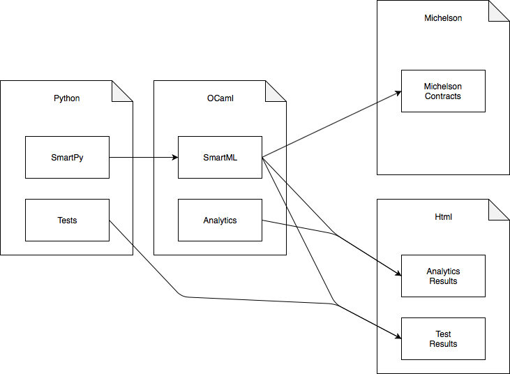

## SmartPy

[SmartPy](https://smartpy.io) is a complete system to develop smart-contracts for the Tezos blockchain. It is an embedded Domain Specific Language \(DSL\) in python that gives the users the ability to write and implement test scenarios to test their smart-contracts. It includes an online IDE, a beautiful origination page to deploy smart-contracts in various Tezos networks, an explorer that allows users to interact with their contracts, and a command-line interface.

Python is used to generate programs in an imperative, type inferred, and intermediate language called SmartML. SmartML is the name of the OCaml library that provides an interpreter, a compiler to Michelson, and a scenario “on-chain” interpreter. The platform uses a mix of OCaml translated to pure javascript through js\_of\_ocaml, Python, and Typescript to glue everything together. The command-line interface is also built using js\_of\_ocaml and runs on Node.js.

### SmartPy Resources

* [SmartPy homepage](https://smartpy.io)
* [SmartPy documentation](https://smartpy.io/reference.html)
* [SmartPy IDE](https://smartpy.io/ide)

