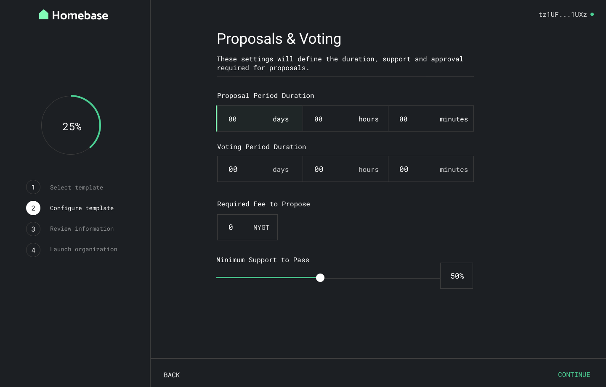
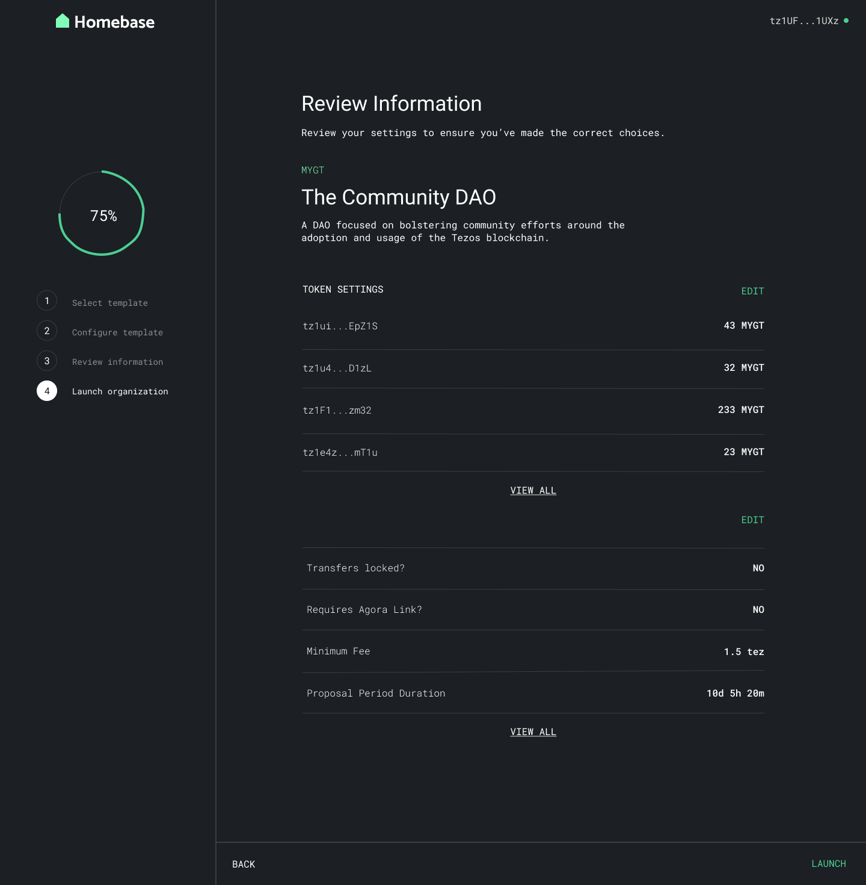

## Decentralized Autonomous Organizations (DAOs)

### Introduction to DAOs

### DAOs

A decentralized autonomous organization is a collective of individuals or organizations governing resources, registries, or rules. These types of organizations avoid problems typically faced by traditional hierarchies through increased transparency and automated execution. DAO decision-making can be leveraged for something as simple as transferring funds to an individual account or organization, to the execution of code and updating a DAO with an entirely new set of rules. Decisions that are made by a DAO are transparent, with activity and voting being reflected on-chain to avoid any pitfalls of closed-door decision-making. Upgrades and proposals in DAOs are typically automatically executed once a proposal reaches a required quorum, reflecting both a DAOs ability to be agile and efficient.

### Standards and Resources

As the number of decentralized applications and community initiatives in the Tezos ecosystem grows, so does the need for community governance and, of course, DAOs.

Within the Tezos ecosystem, the following smart contract frameworks enable anyone to create and interact with DAOs:

* [BaseDAO](https://github.com/tqtezos/baseDAO) is a smart contract framework enabling anyone to create a DAO on Tezos for the decentralized governance of resources, registries, or rules 
* [Homebase](https://tqtezos.medium.com/daos-on-tezos-announcing-homebase-80bbecbb9bfe) is a user interface for DAOs, built to empower developers and communities to launch and participate in Tezos-based DAOs

Homebase also provides DAO participants a dashboard to create and vote on proposals that can modify or upgrade governed smart contracts. Below is a preview of Homebase's intuitive UI for creating and interacting with DAOs created using the BaseDAO framework. The interface enables DAO creators to spin up DAOs based on several templates, select parameters of the governance process \(e.g. quorum\) and allocate an initial distribution of the DAO’s native token. It will also include integration with exciting new Tezos capabilities like [Tezos Domains](https://docs.tezos.domains/).

Over the coming weeks and months, we’ll be enhancing and extending these templates for new exciting applications such as fractional ownership of NFTs and DAOs for simple off-chain vote signaling.

### DAO Examples

* **Public Goods Funding** - Public goods are any collective resource that we use \(for blockchains, this could be infrastructure and tooling\) that typically suffer from the [free-rider problem](https://en.wikipedia.org/wiki/Free-rider_problem). In order to prevent the underfunding of public goods that are typically relied upon for critical infrastructure, a DAO can be established by a group of actors and projects in a particular ecosystem to direct a treasury of donations towards funding the development and maintenance of public goods.
* **Protocol DAO** - Decentralized protocols typically have a number of parameters that need to continually be modified to ensure the safety of a system. For this, let's use the example of a decentralized lending protocol. Parameters that are typically modified in a decentralized lending protocol include collateralization rates which ensure the safety of loans during times of high market volatility or even types of assets supported for lending. A DAO consisting of token holders incentivized to keep this decentralized system operational can continually propose changes and vote on these parameters. 

