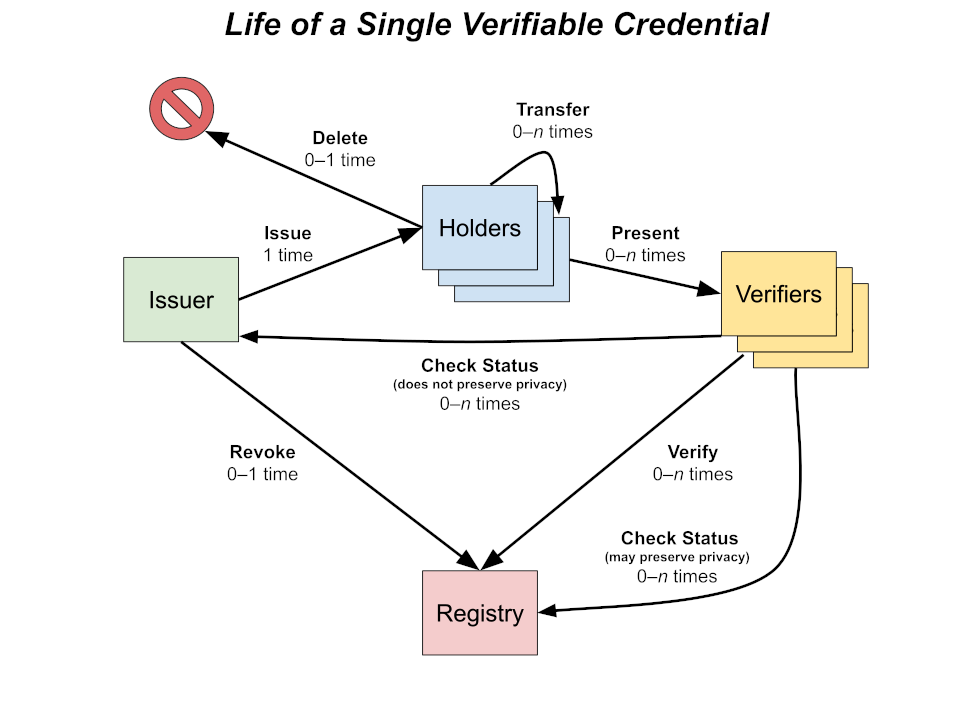

## Identity (DID)

### Introduction

Identifying users stably, securely, with the minimum invasion of privacy or risk of leakage, is one of the core problems of essentially all software systems. Since the great boom of personal computers and the modern software industry, this has created a whole sub-industry of identity and access-management \(IAM\) technologies, which overwhelmingly improve the mousetrap of mapping users to "accounts," which are essential bureaucratic files stored in central databases that concentrate not just informational power, but also risk, liability, and value. It bears mention that these are modeled on bank accounts.

As more and more real-world value has been digitized over the decades, "identity data" has become a chokepoint for virtually all other digital value systems, the keys to every kingdom. Furthermore, every central repository of personal information has become a _de facto_ "honeypot" or target of opportunistic business models, many of them illegal and based on exfiltration, deception, or interception of personal data. The legal spheres of so-called "ad tech" and data brokerages and the illegal spheres of espionage, identity theft, and industrialized computer fraud share many characteristics: they are both growing every year, they are largely impervious to regulation, and they are deeply demoralizing and disempowering to the average end-user.

In recent years, however, we have seen a wave of identity technologies emerge that strive to re-architect this whole landscape defensively, keeping ultimate and fine-grained control over all personal data in the most direct and accessible personal control possible. Decentralization of data systems, in the sense of bottoms-up governance of infrastructure and alternatives to monopolistic and monopsonistic platform economics, tends to fit hand in glove with decentralized identity technologies. Center stage among this web of human-centric technologies is increasingly given to so-called "self-sovereign identity," which apply decentralized identity technologies to management of individuals' personal data.

### A Social Theory of Decentralized Identity

Breaking the momentum of decades of centralized server/client architectures and "user accounts" requires a rethinking of the basic assumptions of data management, as well as data business. This requires imagining forms of information that can be self-securing, highly portable, self-verifying, and not bound too tightly to their original context and architecture. While this may sound like an esoteric problem for computer science, it is also a political, legal, and social question, because it requires reconceiving of the roles and rights of all the parties to data exchanges.

Decentralized identity thinking tends to call any valuable information about someone a "credential" and the person in question a "subject". It names the roles thusly: 1. "Issuers", who emit **portable** credentials about a subject, rather than credentials locked to their own infrastructure and data semantics, 2. "holders" of that information, usually the subjects or trusted agents acting on their behalf, 3. "verifiers" who might consume or act on that information, including auditors and liable parties.

The goals of decentralized identity are often expressed in negatives and minimums: the disclosure of the minimum data to each verifier necessary to their purpose, the minimum possibility of exfiltration or correlation \(colloquially, "tracking"\), the highest possible barrier to collusion between verifiers, the greatest possible privacy for all parties relative to their peers and counterparties. Even things like checking the revocation status when verifying a revocable credential is thought of defensively-- how to ensure that the issuer can revoke a credential while still ensuring that it receives no information about who verifies it, or how often? This requires sophisticated indirection, and new ways of hiding sensitive information in shared, even public data registries.

Src: [DID specification](https://w3c.github.io/vc-data-model/#ecosystem-overview)

#### The Mechanics of Data Registries

From the point of view of politics, this impersonal and democratic archive of verifiable "facts" accessed in common by all parties, is the most mysterious and enigmatic of the actors. Decentralization makes many such omnipotent but impersonal authorities in the form of ledgers, oracles, "blockchains," and meshes of immutable or content-addressed data, so this concept may be less mysterious to those steeped in those technologies. It is a registry in the sense that all data gets puts there \(registered\) by people and software running on behalf of people and organizations, but it is a decentralized and unconventional series of linked registries.

Formal verification makes verifiable data doubly verifiable-- and for this reason, the authors of this primer think Tezos is particularly well-suited to identity use-cases managing real value at production scale and with a grounding in real auditing, liability, and risk management.

#### The Mechanics of Verifiable Credentials

There is a whole specialists' vocabulary used to describe how credentials are handled, stored, presented, verified, and revoked. The software that individual actors use to receive, hold, and present them is called a "wallet", and the software used to issue, transfer, revoke, and verify them is called an "agent". Both interact with verifiable registries \(i.e blockchains and blockchain-like data stores\) in various ways, must importantly for identifying and verifying each other. Spruce Systems has open-sourced a white-label wallet called Credible, and the engine Spruce uses to create and power agents is called DIDKit. Both are intended to work at many scales and in many contexts, and come with Tezos-writing and verifying capabilities built in, with the option to extend support to other blockchains with Rust crates \(see below\).

Src: [DID specification](https://www.w3.org/TR/vc-data-model/#lifecycle-details)

#### The Mechanics of Decentralized Identifiers

Verifiable Credentials are designed refer to their issuers and subjects verifiably. This means that in the ideal case, any reference to an entity should be under that entity's direct and ultimate control, yet still be used to verify the credential's contents and trustworthiness cryptographically. In plain language, this means that a verifier would need to be able to get a cryptographic public key corresponding to that identifier, which might change or be deactivated over time.

Src: [DID specification](https://www.w3.org/TR/did-core/#architecture-overview)

The most "decentralized" of the identifiers that meet these requirements are so-called "decentralized identifiers," or DIDs. These are each registered and resolved on autonomous namespaces \(often closely coupled to specific public-readable DLTs like blockchains\), which function as verifiable data registries for their specific kind of identifiers. Each such namespace is governed by a "DID Method," which is a publically-specified micro-protocol containing namespace rules, CRUD and resolution mechanics, cryptographic signatures schemes, and blockchain-specific data models and algorithms. Each "DID method" has unique characteristics and infrastructures, with particular strengths and weaknesses; even their security guarantees and privacy engineering vary widely, so it can be dangerous to assume they are all equal and interchangeable. Each is like a little internet unto itself!

### Tezos and decentralized identity

The Tezos community is committed to the highest standards in protocol engineering, formal verification, external review, and other best-practices to guarantee world-class software. Spruce Systems, which authored this primer as well as the Tezos "DID Method". For more information about the company itself, see their [website](https://spruceid.com/), or to go straight to detailed information about their decentralized identity server toolkit [DIDKit](https://spruceid.dev/docs/didkit) and their white-label identity wallet [Credible](https://spruceid.dev/docs/credible), see their [Developer Portal](https://spruceid.dev/).

Spruce is an open-source, decentralized identity company that works openly to advance these technologies in a sustainable, standards-driven way. We share the values of the community that has been driving this technology for a decade, and we want to see it succeed in the most organic and decentralized way possible. That means high standards for future-proof engineering, and an open-source strategy that keeps infrastructure and standards governance in the hands of a democratic commons.

### Further Reading

Further educational/contextual resources on decentralized identity topics can be found on the [Education page](https://identity.foundation/education/) of the Decentralized Identity Foundation.

For insight into the core specifications authored and maintained by the W3C working group, the best overview is the github repositories section of their [homepage](https://www.w3.org/2019/did-wg/) on W3.org. The largely overlapping [Credentials Community Group](https://w3c-ccg.github.io/), with weekly open, recorded, and scribed [calls](https://w3c-ccg.github.io/meetings/) open to W3C non-members, is also a good venue for getting to know the debates around the core specifications.

